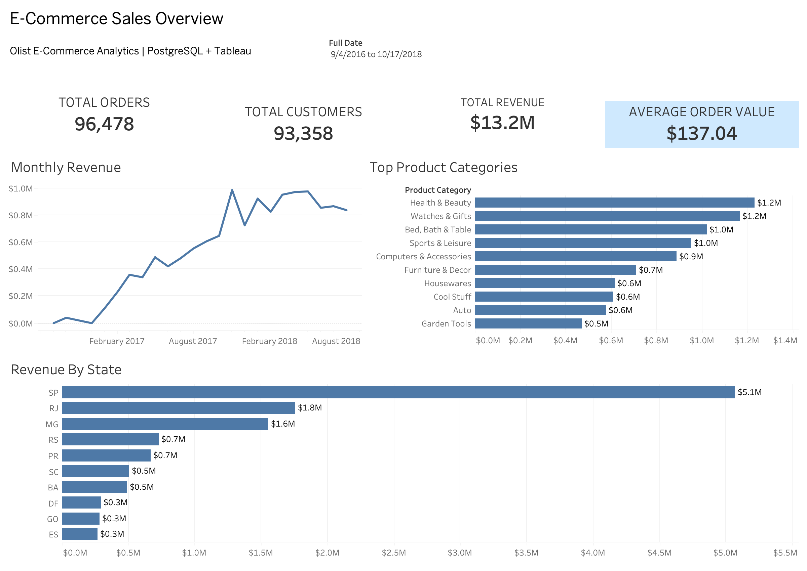

# E-Commerce Analytics Warehouse

An end-to-end data engineering and analytics project that transforms raw Brazilian e-commerce data into a PostgreSQL data warehouse and interactive Tableau dashboard.

**[View Interactive Tableau Dashboard](https://public.tableau.com/views/OlistE-CommerceAnalyticsWarehouse/Dashboard1?:language=en-US&:sid=&:redirect=auth&:display_count=n&:origin=viz_share_link)**



## Overview

This project uses the Brazilian E-Commerce Public Dataset by Olist to build an analytics-ready data warehouse from raw transactional data.

I built a Python ETL pipeline to load the source data into PostgreSQL staging tables, transformed the data into a dimensional model, and wrote SQL analyses to explore sales, customers, products, sellers, and geographic performance. The warehouse is connected to Tableau for interactive business reporting.

### Pipeline

**Olist CSV Data → Python/Pandas ETL → PostgreSQL Staging → Star Schema → SQL Analysis → Tableau**

## Tech Stack

- **Python / Pandas** — data exploration and ETL
- **PostgreSQL** — staging and analytical data warehouse
- **SQL** — dimensional modeling and business analysis
- **Tableau** — interactive dashboard and visualization
- **Git / GitHub** — version control

## Data Model

The primary analytical table, `fact_sales`, uses an **order-item grain**, meaning each row represents one product sold within an order.


### Dimensions

- `dim_customer` — customer location and unique customer identity
- `dim_product` — product category and physical attributes
- `dim_seller` — seller and geographic information
- `dim_date` — calendar attributes for time-series analysis

### Fact Tables

- `fact_sales` — order-item sales, prices, freight, and dimensional keys
- `fact_payments` — payment method, installments, and payment values

Payments are modeled separately from sales because an order can contain multiple items and multiple payment records. Joining both directly at the order level would create a many-to-many fan-out and inflate aggregated values.

## ETL Process

The ETL pipeline loads the raw Olist CSV files into PostgreSQL staging tables before transforming them into the analytical warehouse.

The staging layer preserves the structure of the source data, while the warehouse layer introduces:

- Surrogate keys
- Fact and dimension tables
- Translated product categories
- Standardized date attributes
- Foreign-key relationships
- Defined analytical grain

This separation keeps ingestion independent from the transformations used for reporting.

## SQL Analysis

The project includes SQL queries answering several business questions:

- How does revenue and order volume change over time?
- Which product categories generate the most revenue?
- Which customer states generate the most revenue?
- Which sellers generate the most revenue?
- Which customers make repeat purchases?

The queries demonstrate joins across the dimensional model, CTEs, aggregation, distinct counting, filtering, and ranking.

## Dashboard

The Tableau dashboard provides an interactive view of e-commerce performance,
including revenue, order volume, customer activity, product categories, and
geographic trends.

**[View the interactive dashboard on Tableau Public](https://public.tableau.com/views/OlistE-CommerceAnalyticsWarehouse/Dashboard1?:language=en-US&:sid=&:redirect=auth&:display_count=n&:origin=viz_share_link)**


For delivered orders in the dataset, the dashboard reports approximately **$13.2M in revenue across 96K orders**.

<!-- Add Tableau Public link here after publishing -->
<!-- [View Interactive Tableau Dashboard](YOUR_TABLEAU_PUBLIC_URL) -->

## Repository Structure

```text
ecommerce-data-warehouse/
├── data/
│   └── raw/                  # Raw data (excluded from Git)
├── dashboard/
│   └── ecommerce_dashboard.twb
├── docs/
│   ├── dashboard.png
│   └── star_schema.png
├── etl/
│   └── load_staging.py
├── notebooks/
│   └── explore_olist.ipynb
├── sql/
│   ├── create_warehouse.sql
│   └── business_queries.sql
├── .gitignore
├── README.md
└── requirements.txt
```

## Running the Project

### 1. Clone the repository

```bash
git clone <repository-url>
cd ecommerce-data-warehouse
```

### 2. Create a Python environment

```bash
python3 -m venv .venv
source .venv/bin/activate
pip install -r requirements.txt
```

### 3. Create the PostgreSQL database

```sql
CREATE DATABASE ecommerce_warehouse;
```

### 4. Load the staging tables

Place the Olist CSV files in `data/raw/`, configure the PostgreSQL connection, and run:

```bash
python etl/load_staging.py
```

### 5. Build the warehouse

Run the warehouse SQL against the PostgreSQL database:

```bash
psql -d ecommerce_warehouse -f sql/create_warehouse.sql
```

### 6. Run the analysis

```bash
psql -d ecommerce_warehouse -f sql/business_queries.sql
```

## Dataset

This project uses the **Brazilian E-Commerce Public Dataset by Olist**, containing approximately 100,000 orders from Brazilian online marketplaces.

The dataset includes information about orders, customers, products, sellers, payments, reviews, and product categories.

## Key Takeaways

Building this project provided experience with:

- Designing a dimensional data warehouse
- Defining and maintaining fact-table grain
- Building a reproducible ETL workflow
- Modeling one-to-many relationships without double-counting
- Writing analytical SQL against a star schema
- Connecting a PostgreSQL warehouse to a BI tool
- Turning transactional data into an interactive business dashboard